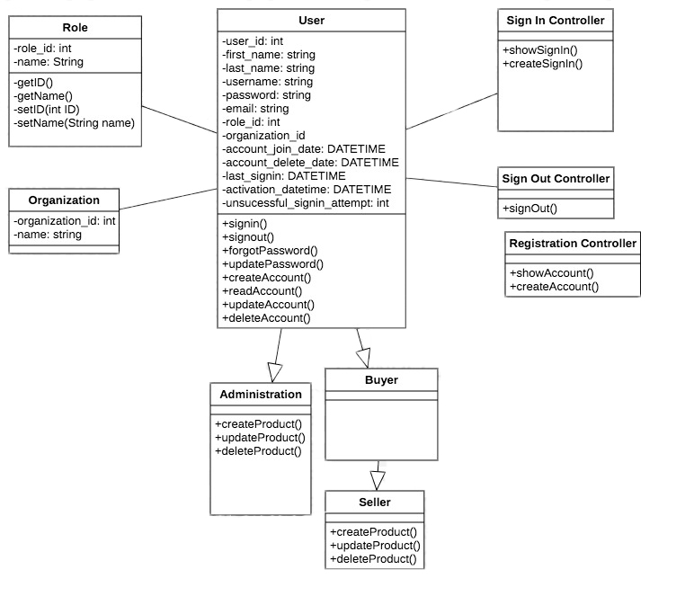

## Iteration 1 Test Plan Description

### Registration

* **Main Success Scenario**
  * The user will be prompted for an email address and username, which will be used for identification such as logging in, password resets and support. (Email address and Username has to be unique)
  * Password and confirm password must meet the requirements.
  * The user must accept the Conditions of Use and Privacy Notice agreement in order to create an account. 
  * Once the information entered meets the registration requirements, the user will be signed in, and an activation/verification email will be sent in order to confirm their identity/account, which will then allow them to purchase/sell products.
  * The admin level account must be created through another admin. A username will be their “firstname.lastname”.  A temporary password will also be generated for them, which they can change later. Admin account does not require activation.

* **Alternate Flow**
  * If the email address is already in database as a registered user, the user will be asked to enter a different email address. Also, a message will be shawn stating that there an existing account associated with the email address entered.
  * If the username has been taken, the user will need to enter a different username.
  * If the password does not meet the registration requirements, the user needs to re-enter a password that meets the requirements. Once the information meets the registration requirements, the user will be signed in and sent an activation email.
  * For admin account, if there happens to be another person with same name, a number will be added after last name.

### Sign In

* **Main Success Scenario**
  * The user will be prompted, for a email and a password. Once the user has been successfully authenticated and the account is not locked/suspended, the user will be redirected to the front page.
  
* **Alternate Flow**
  * If the user fails to authenticate with the email and a password, it will prompt to re-enter the email and password.
  
### Sign Out

* **Main Success Scenario**
  * If the user clicks on the “Sign out” button, the user will be sign out and the user will be redirected to Sign In page.
  * If the user forgets to sign out, or if the user tries to close the tab/window, they will be prompted with a message box stating that they will be signed out once they press “OK” and that they’ve acknowledged that. If they press “Cancel”, it will simply close the message box.
  
* **Alternate Flow**
  * If the user clicks "Cancel" on prompted message box, the user needs to sign out manually and the tab/window woould not be closed.

## Iteration 1 Class Diagram

