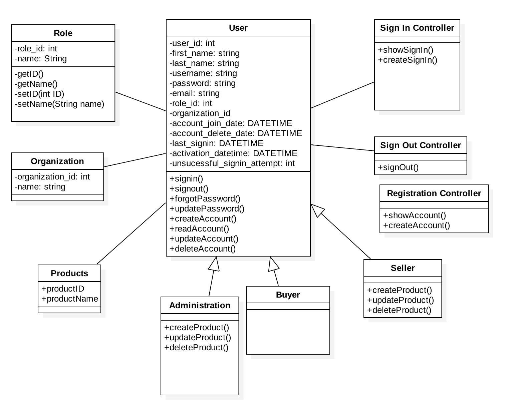

## Iteration 2 Test Plan Description

### Edit User Account(s) Details (For Admin Only)
  * **Main Success Scenario**
     * The user must be logged in as an admin. By clicking on the Users page from navbar, it will redirect you to the page which has all the user details list.
     * Click on one of the user's name, in order to view individual's account details.
     * Click on the edit account button, in order to edit/change individual's account details.
     * User can change the individual's firstname & lastname (for now).
     * Once the information entered meets the requirements, the information for individual's account will be updated.
  * **Alternate Flow**
     * If the user is not loged in as an admin, then the user cannot access all the users' information page. User needs to sign in with the admin credintials.
     * If the change does not meet the requirements, then the user will need to re enter the information.

### Viewing Product Page (Template)
  * **Main Success Scenario**
     * User can view a product and select different variations for example, different colors, different types, etc.
     * user can choose the quantity that they want to purchase. As well as multiple options for shipping the product.
  * **Alternate Flow**
     * If the product does not exist, it will prompt message that the product does not exist.

## Iteration 2 Class Diagram

