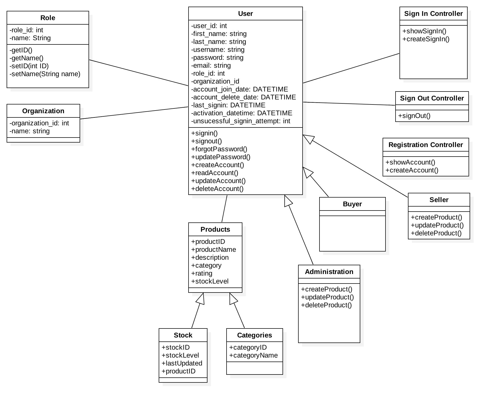

## Iteration 3 Test Plan Description

### Adding Product
  * **Main Success Scenario**
     * To add a product, user must be signed in as Seller or Admin.
     * Go to Product page, and click on Add a Product button and it should open a page where it will ask you to enter a product name, product description, and a price.
     * If the entered details is valid, the user can successfully pass the product to Admins to approve it.
  * **Alternate Flow**
     * If user does not have a Seller account, user must sign up as Seller in order to sell their product.

### Approving Product
  * **Main Success Scenario**
     * The user must be logged in as Admin in order to approve products.
     * Go to product page, where the user can find all the products - approved and non-approved.
     * User can approve the product by clicking on not-approved.
  * **Alternate Flow**
     * If the user does not have admin account, individual does not have authority to approve the product.
     * User must sign up for admin account.
     
## Iteration 3 Class Diagram

