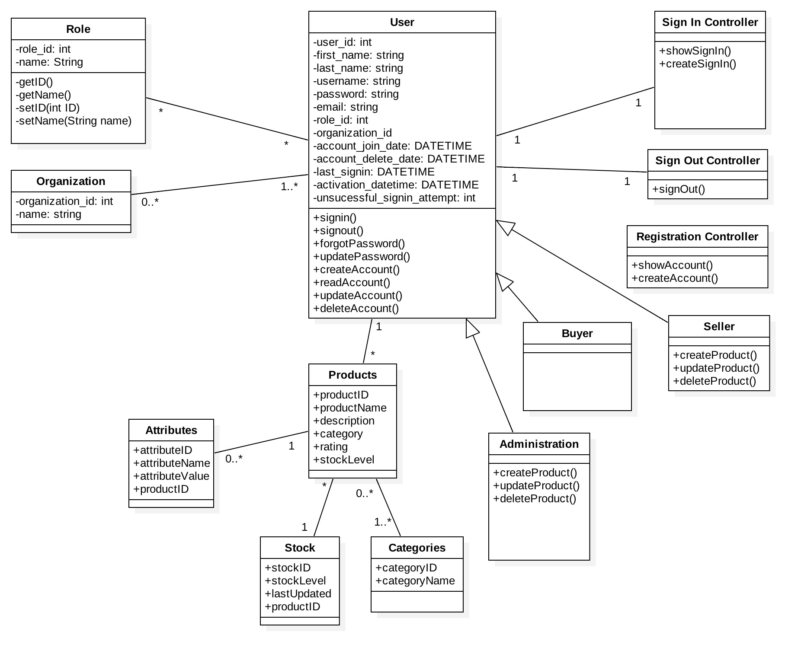

## Iteration 4 Test Plan Description

### Write a Review
  * **Main Success Scenario**
     * If the user writes a review and if it meets the requirements (not empty and less then 200 character), then the user can successfully submit the review.
  * **Alternate Flow**
     * If the user has 0 characters (empty) in the review, then the user needs to add more characters to review.
     * If the user has more then 200 characters in the review, then the user needs to make the review shorter by deleting or decreasing the amount of characters.

### Approving Product
  * **Main Success Scenario**
     * (coming soon)
  * **Alternate Flow**
     * (coming soon)
     
## Iteration 4 Class Diagram

