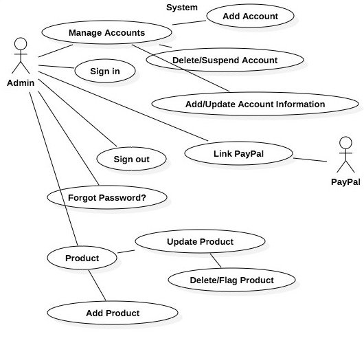
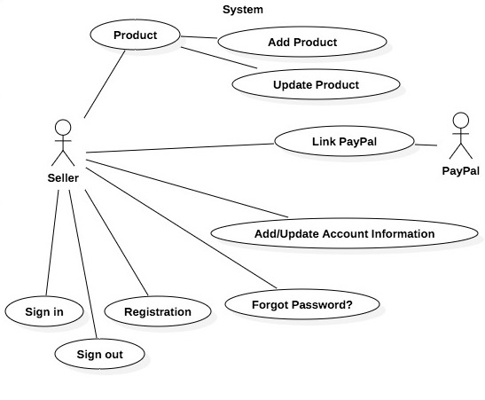
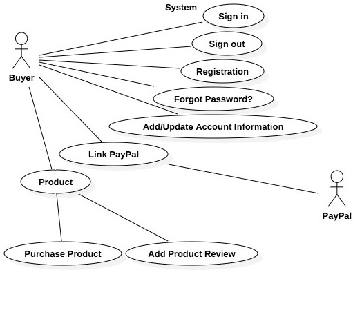

# Team_25
  * Carlos A. Gomez
  * Nitish Bajaj
  * Niramay Patel
  
## System Description
We are developing an E-commerce platform, this platform consists of 3 parts:
 1. **An Admin System** which is a dashboard for our own commerce and account management. It will also be used for approval of marketplace products and adding our internal products.
 2. **A Marketplace System** which is for our customers to list and sell their Product. It will include customization (colour/model, custom order), ability to add Product Name/Description/Instruction/Specifications, choose Shipping options, purchase multiple quantity (In stock/Out of stock/Continued/Discontinued), view the price of a product, place the product in a specific category, Ratings for the buyers, Q/A's for any questions the buyer might have for the seller. It will also contain a "Orders List/Page", which will display which order(s) has been shipped, or being processed before shipping. As well as, which order(s) have been delivered to the customer, or have been confirmed to be delivered by the customer. In adition to an online payment system that will allow sellers to receieve funds will be PayPal.
 3. **A Shopping System** which will allow customers to purchase our products, and the marketplace products. It will be an online listing of products (which has the ability to search, to view and purchase the products). Once a purchase has been made through the shopping cart,the buyer(s) can rate product(s), email the seller( regarding any defects or any concerns) before making a purchase. The online payment system that will allow buyers to pay products will bePayPal.

NOTE: The product page will have all the settings to finalize marketplace listing. Verified purchasers will be able to give a product review on the purchased item, so that it helps the other customers to understand it better.

## Admin System Use Case Diagram & Description

### Manage Account
* **Main Success Scenario**
  * Admin will have the ability to add/remove/update buyer and seller  account(s).

### Sign In
* **Main Success Scenario**
  * The admin will be prompted, for a username/email and a password. Once the admin has been successfully authenticated, the admin will be redirected to the dashboard.
* **Alternate Flow**
  * The admin has forgotten the password: Click the “Forgot password?” link and they will be prompted to enter their email. The admin will be sent an email containing a reset link. Once the password has been reset, the admin will be signed in.

### Sign Out
* **Main Success Scenario**
  * The admin can click on the “Sign out” button to sign out. 
* **Alternate Flow**
  * If an admin forgets to sign out: Within an hour, the session expires and the admin will be signed out.

### Forgot Password
* **Main Success Scenario**
  * The admin will be prompted for an email address. If the email exists in the database, the admin will receive an email which will allow the admin to reset their account password.
* **Alternate Flow**
  * If the admin is unable to login after 5 attempts: the admin will be suggested to reset the password using “Forgot my Password?” page.

### Revoke/Reinstate Seller Privileges
* **Main Success Scenario**
  * The admin will be prompted to  Select a  User and  then the system will ask twice- for safety  to revoke admin privileges or in case of seller  status  seller  privileges.
* **Alternate Flow**
  * The admin will be prompted to select a  user and then will ask if user needs to have to be added  seller  status user will then be twice prompted  for security confirmation.
  * The admin will be prompted to select a suer and then ask if user needs to be  added to admin user will then be twice twice prompted  for security confirmation.

### Link Paypal Account
* **Main Success Scenario**
  * The admin will be prompted to insert the shared company PayPal username and password, to link a billing method in order to sell products.
* **Alternate Flow**
  * The admin will be prompted to link shared company PayPal billing method before posting a product, if not already linked.

### Add Product
* **Main Success Scenario**
  * Admin enters Product Name, Product Description, Product Specifications (Brand name, Weight, Model, etc.), Price, Product Pictures, Current Stock level of the product, Continued/Discontinued checkbox, Category, Q/A’s. Once submitted the product will be available for purchase. 
* **Alternate Flow**
  * Admin enters Product Name, Product Description, Product Specifications (Brand name, Weight, Model, etc.), Price, Product Pictures, Current Stock level of the product, Continued/Discontinued checkbox, Category, Q/A’s Then selects which users/store have  this product listed,  this once  submitted is allowed for purchase.

### Update Product
* **Main Success Scenario**
  * Admin changes  specific entries in the Product Page such as: Product Name, Product Description, Product Specifications (Brand name, Weight, Model, etc.), Price, Product Pictures, Current Stock level of the product, Continued/Discontinued checkbox, Category, Q/A’s. Once submitted, this once  submited is allowed for purchase. The admin can also choose to flag the product, to remove it from the marketplace. 
* **Alternate Flow**
  * Admin changes specific entries of a product page such as  Product Name, Product Description, Product Specifications (Brand name, Weight, Model, etc.), Price, Product Pictures, Current Stock level of the product, Continued/Discontinued checkbox, Category, Q/A’s . This once submitted is allowed for purchase.

## Marketplace System Use Case Diagram & Description

### Registration
 * **Main Success Scenario**
   * The seller will be prompted for an email address, username, password, a confirm password field, optional Phone Number, Address, PayPal and a checkbox that states that the seller agrees to the Conditions of Use and Privacy Notice. Once the information mentioned above has been entered and meets the registration requirements, the seller will be signed in and will be sent an activation/verification email in order for the seller to begin selling products.
 * **Alternate Flow**
   * If the password does not meet the requirements, the seller needs to re enter password that meets the requirements.

### Sign In
 * **Main Success Scenario**
   * The seller will be prompted, for a username/email and a password. Once the seller has been successfully authenticated, the seller will be redirected to the front page.
 * **Alternate Flow**
   * The seller has forgotten the password: Click the “Forgot password?” link and they will be prompted to enter their email. The seller will be sent an email containing a reset link. Once the password has been reset, the seller will be signed in.

### Sign Out
 * **Main Success Scenario**
   * The seller can click on the “Sign out” button to sign out.
 * **Alternate Flow**
   * If a seller forgets to sign out: Within an hour, the session will expire and the seller will be signed out.

### Forgot Password
 * **Main Success Scenario**
   * The seller will be prompted for an email address. If the email exists in the database, the seller will receive an email which will allow the buyer to reset their account password.
 * **Alternate Flow**
   * If the seller is unable to login after 5 attempts: the seller will be suggested to reset the password using “Forgot my Password?” page.

### Update Account Information
 * **Main Success Scenario**
   * The seller will be prompted to insert/update information such as shipping address (Province/State and Country).  Also to update stock level or continued/discontinued.
 * **Alternate Flow**
   * The buyer will be prompted to insert/update required shipping information during checkout.

### Link Paypal Account
 * **Main Success Scenario**
   * The seller will be prompted to insert their PayPal username and password, to link a billing method in order to sell products.
 * **Alternate Flow**
   * The buyer will be prompted to link PayPal billing method before posting a product, if not already linked.

### Add/Update Product
 * **Main Success Scenario**
   * Seller enters Product Name, Product Description, Product Specifications (Brand name, Weight, Model, etc.), Price, Product Pictures, Current Stock level of the product, Continued/Discontinued checkbox, Category, Q/A’s. Once submitted, the product will be sent for approval. Once approved the product will be available for purchase.
 * **Alternate Flow**
   * Admin can add/upload a product on behalf of the seller as Customer support.
  
### Edit Product
 * **Main Success Scenario**
   * Seller changes  specific entries in the Product Page: Product Name, Product Description, Product Specifications (Brand name, Weight, Model, etc.), Price, Product Pictures, Current Stock level of the product, Continued/Discontinued checkbox, Category, Q/A’s. Once submitted, if  the product is approved it will only  update the data, if product is not approved  yet  it just sends admin the  notification  product been modified.
 * **Alternate Flow**
   * Admin can Edit a product on behalf of the seller as Customer support.
   
## Shopping System Use Case Diagram & Description

### Registration
 * **Main Success Scenario**
   * The buyer will be prompted for an email address, username, password, a confirm password field, optional Phone Number, Address, PayPal and must confirm using a checkbox that states that the buyer agrees to the Conditions of Use and Privacy Notice. Once the information mentioned above has been entered and meets the registration requirements, the buyer will be signed in and will be sent an activation/verification email in order for the buyer to begin buying products. In order to purchase a product the user must have to link his/her Paypal account.
 * **Alternate Flow**
   * The buyer will be prompted to for an email address, username, password, a confirm password. If the username has been taken, the buyer will need to enter a different username. If the password does not meet the requirements, the buyer needs to re-enter a password that meets the requirements. Once the information meets the registration requirements, the buyer will be signed in. If the user has not linked the Paypal account at the end of checkout process, then the user has to link his/her Paypal account in order to make the purchase.
   
### Sign In
 * **Main Success Scenario**
   * The buyer will be prompted, for a username/email and a password. Once the buyer has been successfully authenticated, the buyer will be redirected to the front page.
 * **Alternate Flow**
   * The buyer has forgotten the password: Click the “Forgot password?” link and they will be prompted to enter their email. The buyer will be sent an email containing a reset link. Once the password has been reset, the buyer will be signed in.
   
### Sign Out
 * **Main Success Scenario**
   * The buyer can click on the “Sign out” button to sign out.
 * **Alternate Flow**
   * If a buyer forgets to sign out: Within an hour, the session will be expired and the buyer will be signed out.
   
### Forgot Password
 * **Main Success Scenario**
   * The buyer will be prompted for an email address. If the email exists in the database, the buyer will receive an email which will allow the buyer to reset their account password.
 * **Alternate Flow**
   * If the buyer is unable to login after 5 attempts: the buyer will be suggested to reset the password using “Forgot my Password?” page.
   
### Add/Update Account Information
 * **Main Success Scenario**
   * The buyer will be prompted to insert/update information such as billing and shipping address (Street number, name of street, postal code, Province/State and Country).
 * **Alternate Flow**
   * The buyer will be prompted to insert/update required billing and shipping information during checkout.
   
### Link Paypal Account
 * **Main Success Scenario**
   * The buyer will be prompted to insert their PayPal username and password to link a billing method.
 * **Alternate Flow**
   * The buyer will be prompted to link PayPal billing method during checkout, if not already linked.
   
### Add Product Review
 * **Main Success Scenario**
   * The buyer will be prompted to confirm that the goods have been received. The buyer can then write a review and select a number between 1 and 5 depending on how much they are satisfied.
 * **Alternate Flow**
   * The buyer will be prompted to confirm that the goods have been received. The buyer can select a number between 1 and 5 depending on how much they are satisfied.
   
### Purchase Product
 * **Main Success Scenario**
   * The buyer will be prompted to select quantity and can select “Add to cart”. The buyer can then continue shopping or or checkout. During checkout, the buyer will be shown the transaction details and confirm to purchase products using PayPal.
 * **Alternate Flow**
   * The buyer will be prompted to select quantity and can select “Add to cart”. The buyer will be prompted to link their PayPal and update shipping address, if not already done so. Once linked, the buyer can now purchase the products using PayPal.   

 
## Description of Prototype to be delivered in BTS530
Below are the prototypes we plan to deliver thorugh four iterations:
 1. We plan to deliver a prototype system that will allow different account types such as admin, seller and buyer, to authenticate, view only certain interface/layout depending on account permissions.
 2. We plan to deliver a prototype system that will provide admin users to operate the system. This includes, managing accounts, products and sellers will be able to add a product on the market place system for selling.
 3. We plan to deliver a prototype system that will provide sellers with the ability to manage their business such as getting their products to be verified by the admin and update the inventory.
 4. We plan to deliver a prototype system that will provide buyers with the ability to buy products and view transactions.
 
## Iteration 1 Tasks
### To do:
 * Set up Framework, Templates and basic web css
 * Sign in page will be created and tested   
 * Register user page will be created and tested
 * Authentication based on user roles will be created and tested
 * Sign out functionality will be created and tested
 
### Completed:
 * Framework, Templates and CSS -- up and running
 * Registration page and Registration process works
 * Sign Page and authentication works
 * Sign out functionality works
 * Database created and stores the user information
 * Successfully sends out a welcome email to new registered users -- using Mailhog
