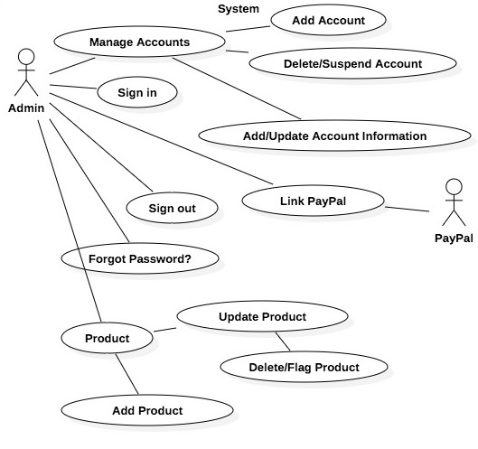

# Team_25
  * Carlos A. Gomez
  * Nitish Bajaj
  * Niramay Patel
  
## System Description
We are developing an E-commerce platform, this platform consists of 3 parts:
 1. **An Admin System** which is a dashboard for our own commerce and account management. It will also be used for approval of marketplace products and adding our internal products.
 2. **A Marketplace System** which is for our customers to list and sell their Product. It will include customization (colour/model, custom order), ability to add Product Name/Description/Instruction/Specifications, choose Shipping options, purchase multiple quantity (In stock/Out of stock/Continued/Discontinued), view the price of a product, place the product in a specific category, Ratings for the buyers, Q/A's for any questions the buyer might have for the seller. It will also contain a "Orders List/Page", which will display which order(s) has been shipped or is being processed before shipping. As well as, which order(s) has been delivered to the customer or have been confirmed to be delivered by the customer. The online payment system that will allow sellers to receieve funds will be through PayPal.
 3. **A Shopping System** which will allow customers to purchase our and the marketplace products. It will be an online listing of products (which has the ability to search, to view and purchase the products). Once a purchase has been made through the shopping cart, buyer(s) can rate product(s), email the seller regarding any defects or any concerns before making a purchase. The online payment system that will allow buyers to purchase products will be through PayPal.

NOTE: The product page will have all the settings to finalize marketplace listing. Verified purchasers will be able to give a product review on the purchased item, so that it helps the other customers to understand it better.

## Admin System Use Case Diagram & Description

### Manage Account
* **Main Success Scenario**
  * Admin will have the ability to add/remove/update buyer and seller  account(s).

### Sign In
* **Main Success Scenario**
  * The admin will be prompted, for a username/email and a password. Once the admin has been successfully authenticated, the admin will be redirected to the dashboard.
* **Alternate Flow**
  * The admin has forgotten the password: Click the “Forgot password?” link and they will be prompted to enter their email. The admin will be sent an email containing a reset link. Once the password has been reset, the admin will be signed in.

### Sign Out
* **Main Success Scenario**
  * The admin can click on the “Sign out” button to sign out. 
* **Alternate Flow**
  * If an admin forgets to sign out: Within an hour, the session will be expired and the admin will be signed out.

### Forgot Password
* **Main Success Scenario**
  * The admin will be prompted for an email address. If the email exists in the database, the admin will receive an email which will allow the admin to reset their account password.
* **Alternate Flow**
  * If the admin is unable to login after 5 attempts: the admin will be suggested to reset the password using “Forgot my Password?” page.

### Revoke/Reinstate Seller Privileges
* **Main Success Scenario**
  * The admin will be prompted to  Select a  User and  then the system will ask twice- for safety  to revoke admin privileges or in case of seller  status  seller  privileges.
* **Alternate Flow**
  * The admin will be prompted to select a  user and then will ask if user needs to have to be added  seller  status user will then be twice prompted  for security confirmation.
  * The admin will be prompted to select a suer and then ask if user needs to be  added to admin user will then be twice twice prompted  for security confirmation.

### Link Paypal Account
* **Main Success Scenario**
  * The admin will be prompted to insert the shared company PayPal username and password, to link a billing method in order to sell products.
* **Alternate Flow**
  * The admin will be prompted to link shared company PayPal billing method before posting a product, if not already linked.

### Add Product
* **Main Success Scenario**
  * Admin enters Product Name, Product Description, Product Specifications (Brand name, Weight, Model, etc.), Price, Product Pictures, Current Stock level of the product, Continued/Discontinued checkbox, Category, Q/A’s. Once submitted the product will be available for purchase. 
* **Alternate Flow**
  * Admin enters Product Name, Product Description, Product Specifications (Brand name, Weight, Model, etc.), Price, Product Pictures, Current Stock level of the product, Continued/Discontinued checkbox, Category, Q/A’s Then selects which users/store have  this product listed,  this once  submitted is allowed for purchase.

### Update Product
* **Main Success Scenario**
  * Admin changes  specific entries in the Product Page such as: Product Name, Product Description, Product Specifications (Brand name, Weight, Model, etc.), Price, Product Pictures, Current Stock level of the product, Continued/Discontinued checkbox, Category, Q/A’s. Once submitted, this once  submited is allowed for purchase. The admin can also choose to flag the product, to remove it from the marketplace. 
* **Alternate Flow**
  * Admin changes specific entries of a product page such as  Product Name, Product Description, Product Specifications (Brand name, Weight, Model, etc.), Price, Product Pictures, Current Stock level of the product, Continued/Discontinued checkbox, Category, Q/A’s . This once submitted is allowed for purchase.

## Marketplace System Use Case Diagram & Description

 
## Description of Prototype to be delivered in BTS530
Below are the prototypes we plan to deliver thorugh four iterations:
 1. We plan to deliver a prototype system that will allow different account types such as admin, seller and buyer, to authenticate, view only certain interface/layout depending on account permissions and be able to add a product on the market place system for selling.
 2. We plan to deliver a prototype system that will provide admin users to operate the system. This includes, managing accounts, products.
 3. We plan to deliver a prototype system that will provide sellers the ability to manage their business such as sell, buy products, view transaction history.
 4. We plan to delier a prototype system that will provide buyers the ability to view, purchase, refund products. Communicate with the seller and view transaction history.
 
## Iteration 1 Tasks
### To do:
 * //
### Completed:
 * (...)
